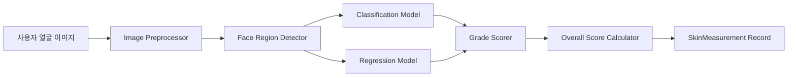
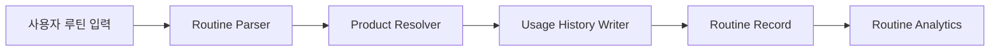
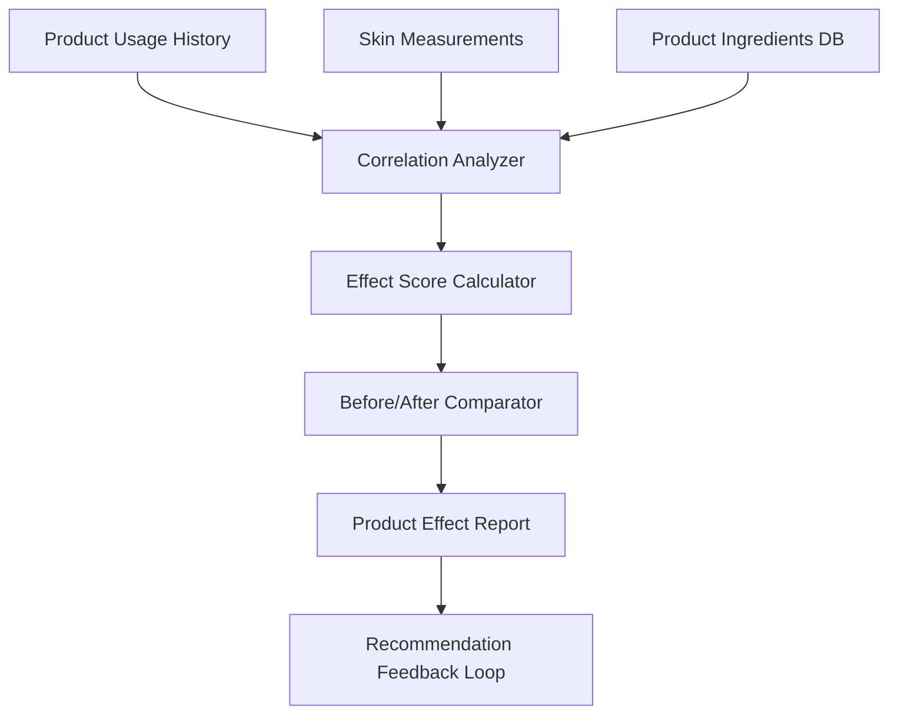
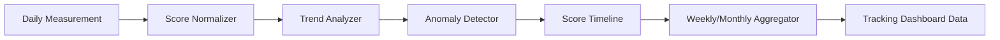
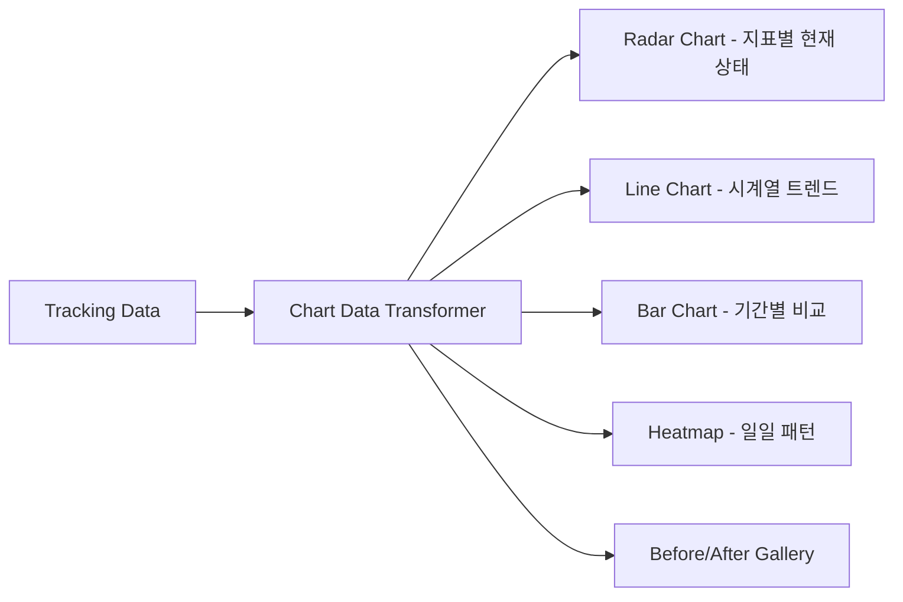
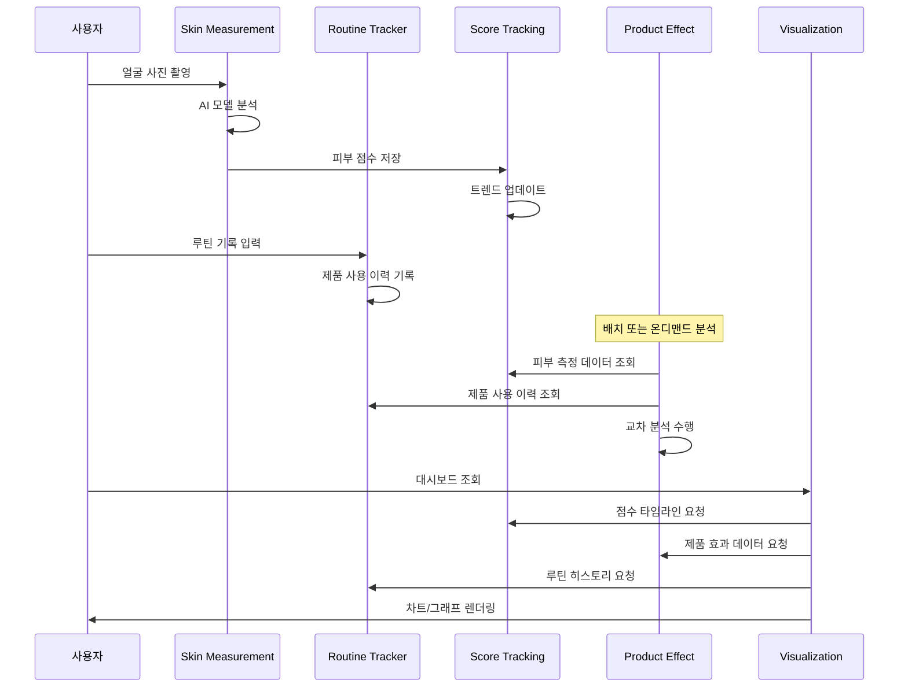

# 02. System Architecture - 스킨케어 루틴 기록 & 데일리 피부 건강 트래킹

## 1. 시스템 개요 (System Overview)

NIA 스킨케어 트래킹 시스템은 사용자의 일일 피부 상태를 측정하고, 스킨케어 루틴을 기록하며, 사용 제품의 효과를 분석하여 피부 변화를 시각화하는 통합 시스템이다.

### 1.1 전체 아키텍처 다이어그램

```
┌─────────────────────────────────────────────────────────────────────┐
│                        CLIENT (React + Vite)                        │
│  ┌──────────┐ ┌──────────┐ ┌───────────┐ ┌──────────┐ ┌─────────┐ │
│  │   Home   │ │ Analysis │ │  Routine  │ │ Tracking │ │ Profile │ │
│  │   Page   │ │   Page   │ │   Page    │ │Dashboard │ │  Page   │ │
│  └────┬─────┘ └────┬─────┘ └─────┬─────┘ └────┬─────┘ └────┬────┘ │
│       │             │             │             │            │      │
│  ┌────┴─────────────┴─────────────┴─────────────┴────────────┴───┐  │
│  │                    State Management (Zustand)                  │  │
│  │  ┌──────────┐ ┌───────────┐ ┌───────────┐ ┌───────────────┐  │  │
│  │  │ Skin     │ │ Routine   │ │ Product   │ │ Tracking      │  │  │
│  │  │ Store    │ │ Store     │ │ Store     │ │ Store         │  │  │
│  │  └──────────┘ └───────────┘ └───────────┘ └───────────────┘  │  │
│  └──────────────────────────┬────────────────────────────────────┘  │
│                             │                                       │
│  ┌──────────────────────────┴────────────────────────────────────┐  │
│  │                   API Client Layer (Axios)                    │  │
│  └──────────────────────────┬────────────────────────────────────┘  │
└─────────────────────────────┼───────────────────────────────────────┘
                              │ HTTPS / REST API
┌─────────────────────────────┼───────────────────────────────────────┐
│                    API GATEWAY (FastAPI)                             │
│  ┌──────────────────────────┴────────────────────────────────────┐  │
│  │                    Auth Middleware (JWT)                       │  │
│  └──────────────────────────┬────────────────────────────────────┘  │
│                              │                                      │
│  ┌──────────┐ ┌──────────┐ ┌┴─────────┐ ┌──────────┐ ┌──────────┐ │
│  │  Skin    │ │ Routine  │ │ Product  │ │  Score   │ │  Visual  │ │
│  │Measuremt │ │ Tracker  │ │ Effect   │ │ Tracking │ │  ization │ │
│  │ Module   │ │ Module   │ │ Analysis │ │ Module   │ │  Module  │ │
│  └────┬─────┘ └────┬─────┘ └────┬─────┘ └────┬─────┘ └────┬─────┘ │
│       │             │            │             │            │       │
│  ┌────┴─────────────┴────────────┴─────────────┴────────────┴────┐ │
│  │                  Service Layer (Business Logic)                │ │
│  └───────────────────────────┬───────────────────────────────────┘ │
│                              │                                     │
│  ┌───────────────────────────┴───────────────────────────────────┐ │
│  │                    ORM Layer (SQLAlchemy)                      │ │
│  └───────────────────────────┬───────────────────────────────────┘ │
└──────────────────────────────┼──────────────────────────────────────┘
                               │
┌──────────────────────────────┼──────────────────────────────────────┐
│                         DATA LAYER                                  │
│  ┌──────────────┐  ┌────────┴───────┐  ┌────────────────────────┐  │
│  │  PostgreSQL   │  │     Redis      │  │   AI Model Server      │  │
│  │  (Primary DB) │  │  (Cache/Queue) │  │   (PyTorch Serving)    │  │
│  └──────────────┘  └────────────────┘  └────────────────────────┘  │
└─────────────────────────────────────────────────────────────────────┘
```

### 1.2 기술 스택 (Technology Stack)

| 계층 (Layer) | 기술 (Technology) | 선택 이유 |
|---|---|---|
| **Frontend** | React 18 + TypeScript + Vite | 기존 프로젝트 스택 유지, 빠른 HMR |
| **State Management** | Zustand | 경량, 보일러플레이트 최소화, React 18 호환 |
| **Charting** | Recharts / D3.js | 피부 변화 시각화, 레이더 차트, 트렌드 그래프 |
| **API Client** | Axios + React Query (TanStack Query) | 캐싱, 재시도, optimistic update |
| **Backend** | FastAPI (Python 3.11+) | 비동기 지원, AI 모델 연동 용이, 자동 API 문서 |
| **ORM** | SQLAlchemy 2.0 | Python 표준 ORM, 마이그레이션 (Alembic) |
| **Primary DB** | PostgreSQL 15+ | JSONB 지원, 시계열 쿼리 최적화, 확장성 |
| **Cache** | Redis 7+ | 세션 캐시, 최근 점수 캐시, Rate Limiting |
| **AI/ML** | PyTorch + ONNX Runtime | 기존 피부 분석 모델 호환 |
| **Auth** | JWT + OAuth 2.0 | 무상태(Stateless) 인증, 소셜 로그인 지원 |
| **Deploy** | Docker + AWS ECS (or GCP Cloud Run) | 컨테이너 기반, 자동 스케일링 |

---

## 2. 모듈 상세 설계 (Module Detail Design)

### 2.1 Module 1: Skin Measurement Module (피부 측정 모듈)

#### 역할
사용자가 촬영한 얼굴 이미지를 AI 모델로 분석하여 5가지 피부 지표(수분, 탄력, 모공, 주름, 색소침착)를 측정하고, 종합 피부 점수(Overall Skin Score)를 산출한다.

#### 아키텍처



#### 입력 (Input)
| 항목 | 타입 | 설명 |
|---|---|---|
| `image` | `File (JPEG/PNG)` | 사용자 얼굴 사진 |
| `user_id` | `UUID` | 사용자 식별자 |
| `capture_metadata` | `JSON` | 촬영 환경 (조명, 디바이스 등) |

#### 출력 (Output)
| 항목 | 타입 | 설명 |
|---|---|---|
| `measurement_id` | `UUID` | 측정 고유 ID |
| `hydration_score` | `float (0-100)` | 수분 점수 |
| `elasticity_score` | `float (0-1)` | 탄력 점수 (R2) |
| `pore_score` | `float (0-2600)` | 모공 점수 |
| `wrinkle_score` | `float (0-50)` | 주름 점수 (Ra) |
| `pigmentation_score` | `float (0-350)` | 색소침착 점수 (ITA) |
| `overall_skin_score` | `int (0-100)` | 종합 피부 점수 |
| `classification_grades` | `JSON` | 부위별 등급 분류 결과 |
| `measured_at` | `datetime` | 측정 일시 |

#### 핵심 로직

**종합 점수 산출 공식:**
```
overall_skin_score = Σ (normalized_metric_i × weight_i) × 100

가중치 (weights):
  - hydration:     0.25  (수분)
  - elasticity:    0.20  (탄력)
  - pore:          0.20  (모공)
  - wrinkle:       0.20  (주름)
  - pigmentation:  0.15  (색소침착)

정규화 (normalization):
  - 각 지표를 0~1 범위로 정규화
  - higherIsBetter=true:  normalized = raw / max
  - higherIsBetter=false: normalized = 1 - (raw / max)
```

#### API Endpoint

```
POST /api/v1/skin/measure
Content-Type: multipart/form-data

Response: {
  "measurement_id": "uuid",
  "scores": { ... },
  "overall_skin_score": 72,
  "classification": { ... },
  "measured_at": "2026-03-07T09:00:00Z"
}
```

---

### 2.2 Module 2: Skincare Routine Tracker (스킨케어 루틴 트래커)

#### 역할
사용자의 아침/저녁 스킨케어 루틴을 기록하고 관리한다. 사용 제품, 적용 순서, 사용 빈도를 추적하여 루틴 패턴을 분석한다.

#### 아키텍처



#### 입력 (Input)
| 항목 | 타입 | 설명 |
|---|---|---|
| `user_id` | `UUID` | 사용자 식별자 |
| `date` | `date` | 루틴 기록 날짜 |
| `time_of_day` | `enum('morning','night')` | 아침/저녁 구분 |
| `steps` | `RoutineStep[]` | 루틴 단계 배열 |

**RoutineStep 구조:**
```json
{
  "order": 1,
  "category": "cleanser",
  "product_id": "uuid",
  "product_name": "이니스프리 그린티 클렌저",
  "amount": "1 pump",
  "notes": "거품 내서 30초 마사지"
}
```

#### 출력 (Output)
| 항목 | 타입 | 설명 |
|---|---|---|
| `routine_id` | `UUID` | 루틴 기록 ID |
| `routine_summary` | `JSON` | 루틴 요약 (단계 수, 소요시간 등) |
| `product_usage_updated` | `boolean` | 사용 이력 업데이트 여부 |
| `streak_count` | `int` | 연속 기록 일수 |

#### 핵심 기능
1. **루틴 템플릿**: 반복되는 루틴을 템플릿으로 저장, 원터치 기록
2. **제품 자동완성**: 이전에 사용한 제품 기반 자동완성
3. **루틴 일관성 점수**: 루틴 기록률, 제품 교체 빈도 기반 점수화
4. **알림 시스템**: 아침/저녁 루틴 기록 리마인더

#### API Endpoints

```
POST   /api/v1/routines                    # 루틴 기록
GET    /api/v1/routines?date=2026-03-07    # 특정 날짜 루틴 조회
GET    /api/v1/routines/templates           # 루틴 템플릿 목록
PUT    /api/v1/routines/{routine_id}       # 루틴 수정
DELETE /api/v1/routines/{routine_id}       # 루틴 삭제
GET    /api/v1/routines/streak             # 연속 기록 일수
```

---

### 2.3 Module 3: Product Effect Analysis Engine (제품 효과 분석 엔진)

#### 역할
사용자의 피부 측정 데이터와 제품 사용 이력을 교차 분석하여, 각 제품이 피부 지표에 미친 영향을 정량적으로 평가한다.

#### 아키텍처



#### 입력 (Input)
| 항목 | 타입 | 설명 |
|---|---|---|
| `user_id` | `UUID` | 사용자 식별자 |
| `product_id` | `UUID` | 분석 대상 제품 |
| `analysis_period` | `DateRange` | 분석 기간 (시작~종료) |
| `skin_measurements[]` | `SkinMeasurement[]` | 기간 내 피부 측정 데이터 |

#### 출력 (Output)
| 항목 | 타입 | 설명 |
|---|---|---|
| `product_effect_score` | `float (-100 ~ +100)` | 제품 종합 효과 점수 |
| `metric_deltas` | `JSON` | 지표별 변화량 |
| `confidence_level` | `float (0-1)` | 분석 신뢰도 |
| `usage_duration_days` | `int` | 사용 기간 (일) |
| `comparison_chart_data` | `JSON` | Before/After 차트 데이터 |

#### 핵심 로직

**제품 효과 분석 알고리즘:**
```
1. 기간 설정
   - before_period: 제품 사용 시작 전 2주
   - after_period:  제품 사용 시작 후 4주 (최소 2주)

2. 지표별 변화량 계산
   delta_i = mean(after_scores_i) - mean(before_scores_i)

3. 정규화 및 방향 보정
   normalized_delta_i = delta_i / range_i × direction_i
   (direction: higherIsBetter ? +1 : -1)

4. 신뢰도 산출
   confidence = min(
     sample_count / min_required_samples,
     usage_days / min_required_days,
     routine_consistency_score
   )

5. 종합 효과 점수
   product_effect_score = Σ(normalized_delta_i × weight_i) × confidence × 100
```

#### API Endpoints

```
GET  /api/v1/products/{product_id}/effect?user_id={uid}        # 제품 효과 분석
GET  /api/v1/products/{product_id}/effect/timeline              # 효과 타임라인
GET  /api/v1/users/{user_id}/products/ranking                   # 제품 효과 랭킹
POST /api/v1/products/{product_id}/effect/compare               # 제품 간 비교
```

---

### 2.4 Module 4: Daily Skin Score Tracking (일일 피부 점수 트래킹)

#### 역할
사용자의 일일/주간/월간 피부 점수를 추적하고, 트렌드를 분석하여 피부 상태 변화의 방향성과 속도를 파악한다.

#### 아키텍처



#### 입력 (Input)
| 항목 | 타입 | 설명 |
|---|---|---|
| `user_id` | `UUID` | 사용자 식별자 |
| `period` | `enum('daily','weekly','monthly')` | 집계 단위 |
| `date_range` | `DateRange` | 조회 기간 |

#### 출력 (Output)
| 항목 | 타입 | 설명 |
|---|---|---|
| `score_timeline` | `TimeSeriesData[]` | 시계열 점수 데이터 |
| `trend_direction` | `enum('improving','stable','declining')` | 추세 방향 |
| `trend_velocity` | `float` | 추세 속도 (점/주) |
| `period_summary` | `JSON` | 기간 요약 (평균, 최고, 최저) |
| `anomalies` | `Anomaly[]` | 이상치 목록 |
| `milestone_events` | `Event[]` | 마일스톤 이벤트 (최고점 달성 등) |

#### 핵심 로직

**트렌드 분석:**
```
1. 이동 평균 (Moving Average)
   - 7일 이동 평균으로 일일 변동 평활화
   - MA_7(t) = mean(scores[t-6 : t])

2. 추세 방향 판별
   - 최근 14일 선형 회귀(Linear Regression) 기울기 계산
   - slope > +0.3/week  → "improving"
   - slope < -0.3/week  → "declining"
   - otherwise          → "stable"

3. 이상치 탐지 (Anomaly Detection)
   - z-score 기반: |score - MA_7| > 2σ → anomaly
   - 이상치 원인 라벨링 (환경 변화, 제품 교체 등)

4. 기간 집계
   - weekly:  7일 평균, 최고/최저, 변화량
   - monthly: 30일 평균, 주간 추세, 목표 달성률
```

#### API Endpoints

```
GET /api/v1/tracking/scores?period=daily&from=2026-02-01&to=2026-03-07
GET /api/v1/tracking/trend?period=weekly
GET /api/v1/tracking/summary?period=monthly&month=2026-03
GET /api/v1/tracking/anomalies?from=2026-01-01
GET /api/v1/tracking/milestones
```

---

### 2.5 Module 5: Skin Change Visualization (피부 변화 시각화)

#### 역할
피부 변화 데이터를 다양한 차트와 비주얼로 렌더링하여 사용자가 직관적으로 피부 상태를 파악할 수 있게 한다.

#### 아키텍처



#### 입력 (Input)
| 항목 | 타입 | 설명 |
|---|---|---|
| `score_timeline` | `TimeSeriesData[]` | 점수 시계열 데이터 |
| `metric_deltas` | `MetricDelta[]` | 지표별 변화량 |
| `routine_history` | `RoutineRecord[]` | 루틴 기록 데이터 |
| `product_effects` | `ProductEffect[]` | 제품 효과 분석 결과 |
| `visualization_type` | `enum` | 시각화 유형 |

#### 출력 (Output)
| 항목 | 타입 | 설명 |
|---|---|---|
| `chart_config` | `JSON` | 차트 설정 (Recharts 호환) |
| `data_points` | `DataPoint[]` | 렌더링용 데이터 포인트 |
| `annotations` | `Annotation[]` | 차트 어노테이션 (이벤트 마커) |
| `summary_text` | `string` | 변화 요약 텍스트 |

#### 시각화 컴포넌트 목록

| 컴포넌트 | 용도 | 라이브러리 |
|---|---|---|
| `SkinRadarChart` | 5개 지표 현재 상태 레이더 | Recharts |
| `ScoreTrendLine` | 종합 점수 시계열 추이 | Recharts |
| `MetricCompareBar` | 기간별 지표 비교 막대 차트 | Recharts |
| `RoutineHeatmap` | 루틴 기록 캘린더 히트맵 | Custom (D3) |
| `ProductEffectChart` | 제품별 효과 비교 차트 | Recharts |
| `BeforeAfterSlider` | Before/After 이미지 비교 | Custom |
| `MilestoneTimeline` | 마일스톤 타임라인 | Custom |

#### 핵심 기능
1. **인터랙티브 차트**: 터치/클릭으로 특정 날짜의 상세 데이터 확인
2. **기간 필터**: 1주/1개월/3개월/6개월/1년 기간 선택
3. **오버레이 이벤트**: 제품 교체, 루틴 변경 등의 이벤트를 차트 위에 마커로 표시
4. **공유 기능**: 차트 이미지를 SNS/카카오톡으로 공유
5. **다크모드 지원**: 시스템 테마에 따른 차트 색상 자동 전환

---

## 3. 모듈 간 데이터 흐름 (Inter-Module Data Flow)

```
┌─────────────────────────────────────────────────────────────────────┐
│                                                                     │
│  ① 사용자가 얼굴 사진 촬영                                           │
│     │                                                               │
│     ▼                                                               │
│  ┌─────────────────────────┐                                        │
│  │  Skin Measurement       │──── 피부 점수 산출 ──────┐              │
│  │  Module                 │                          │              │
│  └─────────────────────────┘                          │              │
│                                                       ▼              │
│  ② 사용자가 루틴 기록                        ┌────────────────────┐  │
│     │                                        │  Daily Skin Score  │  │
│     ▼                                        │  Tracking          │  │
│  ┌─────────────────────────┐                 │                    │  │
│  │  Skincare Routine       │──── 사용 제품 ──┤  ← 일일 점수 저장  │  │
│  │  Tracker                │    이력 기록     │  ← 트렌드 분석     │  │
│  └─────────────────────────┘                 └────────┬───────────┘  │
│     │                                                 │              │
│     │  제품 사용 이력                                   │              │
│     ▼                                                 │              │
│  ┌─────────────────────────┐                          │              │
│  │  Product Effect         │◄── 피부 점수 + ──────────┘              │
│  │  Analysis Engine        │    사용 이력 교차 분석                   │
│  └────────────┬────────────┘                                        │
│               │                                                     │
│               │  분석 결과 (효과 점수, 변화량, 비교 데이터)              │
│               ▼                                                     │
│  ┌─────────────────────────┐                                        │
│  │  Skin Change            │                                        │
│  │  Visualization          │──── 차트, 그래프, 리포트 렌더링           │
│  └─────────────────────────┘                                        │
│                                                                     │
└─────────────────────────────────────────────────────────────────────┘
```

### 데이터 흐름 시퀀스



---

## 4. 데이터 흐름 상세 (Data Flow Detail)

### 4.1 데이터 파이프라인

| 단계 | 소스 모듈 | 대상 모듈 | 데이터 | 트리거 |
|---|---|---|---|---|
| 1 | Skin Measurement | Score Tracking | 피부 측정 결과 | 측정 완료 시 |
| 2 | Routine Tracker | Product Usage History | 제품 사용 기록 | 루틴 저장 시 |
| 3 | Score Tracking + Routine | Product Effect Analysis | 점수 + 사용이력 | 일일 배치 / 수동 요청 |
| 4 | All Modules | Visualization | 집계 데이터 | 대시보드 접근 시 |

### 4.2 캐싱 전략 (Caching Strategy)

| 데이터 | 캐시 위치 | TTL | 무효화 조건 |
|---|---|---|---|
| 최근 피부 점수 | Redis | 1시간 | 새 측정 시 |
| 주간 트렌드 | Redis | 6시간 | 일일 배치 완료 시 |
| 제품 효과 점수 | Redis | 24시간 | 새 측정/루틴 기록 시 |
| 제품 마스터 데이터 | Redis | 7일 | 제품 DB 업데이트 시 |
| 차트 데이터 | Client (TanStack Query) | 5분 | 화면 포커스 시 재검증 |

---

## 5. 인증 및 보안 (Authentication & Security)

### 5.1 인증 흐름

```
┌──────────┐     ┌──────────┐     ┌──────────┐
│  Client  │────>│  Auth    │────>│  JWT     │
│  (React) │     │  Server  │     │  Token   │
└──────────┘     └──────────┘     └──────────┘
     │                                  │
     │    Authorization: Bearer {token} │
     ▼                                  ▼
┌──────────┐     ┌──────────┐     ┌──────────┐
│  API     │────>│  Auth    │────>│  User    │
│  Request │     │  Middle  │     │  Context │
│          │     │  ware    │     │          │
└──────────┘     └──────────┘     └──────────┘
```

### 5.2 보안 정책

| 항목 | 정책 |
|---|---|
| **인증** | JWT (Access Token: 15분, Refresh Token: 7일) |
| **API 통신** | HTTPS (TLS 1.3) 필수 |
| **이미지 저장** | S3 암호화 저장, 사용자별 격리 버킷 |
| **개인정보** | 피부 측정 데이터 AES-256 암호화 |
| **Rate Limiting** | 인증 사용자: 100 req/min, 비인증: 10 req/min |
| **CORS** | 허용 오리진 화이트리스트 관리 |

---

## 6. 확장성 및 성능 (Scalability & Performance)

### 6.1 성능 목표

| 지표 | 목표 |
|---|---|
| API 응답 시간 (P95) | < 200ms (캐시 히트), < 2s (분석 요청) |
| 이미지 분석 시간 | < 5s (AI 모델 추론) |
| 대시보드 로드 | < 1s (초기 로드), < 300ms (필터 변경) |
| 동시 접속 | 1,000 CCU (초기), 10,000 CCU (확장) |

### 6.2 확장 전략

```
Phase 1 (MVP):
  - 단일 서버 (FastAPI + PostgreSQL)
  - Redis 캐시 도입
  - 기본 5개 모듈 구현

Phase 2 (Growth):
  - 읽기 복제본 (Read Replica) 도입
  - AI 모델 서버 분리
  - CDN 도입 (이미지 서빙)

Phase 3 (Scale):
  - 마이크로서비스 분리 (모듈별)
  - 메시지 큐 (Celery + Redis) 비동기 처리
  - 시계열 DB (TimescaleDB) 도입
```

---

## 7. 에러 처리 및 모니터링 (Error Handling & Monitoring)

### 7.1 에러 코드 체계

| 코드 범위 | 모듈 | 예시 |
|---|---|---|
| `SKIN-1xx` | Skin Measurement | `SKIN-101`: 이미지 품질 부족 |
| `ROUT-2xx` | Routine Tracker | `ROUT-201`: 중복 루틴 기록 |
| `PROD-3xx` | Product Effect | `PROD-301`: 분석 데이터 부족 |
| `TRAK-4xx` | Score Tracking | `TRAK-401`: 기간 범위 초과 |
| `VIZZ-5xx` | Visualization | `VIZZ-501`: 차트 데이터 변환 실패 |

### 7.2 모니터링 스택

| 도구 | 용도 |
|---|---|
| **Sentry** | 에러 트래킹, 프론트엔드 + 백엔드 |
| **Prometheus + Grafana** | 메트릭 수집 및 대시보드 |
| **CloudWatch / GCP Logging** | 인프라 로그 |
| **Datadog APM** (선택) | 분산 트레이싱 |

---

## 8. 디렉터리 구조 (Directory Structure)

### Frontend (추가되는 구조)

```
frontend/src/
├── api/
│   ├── client.ts              # (기존) Axios 인스턴스
│   ├── analyze.ts             # (기존) 분석 API
│   ├── routine.ts             # (신규) 루틴 API
│   ├── tracking.ts            # (신규) 트래킹 API
│   └── product-effect.ts      # (신규) 제품 효과 API
├── stores/
│   ├── useSkinStore.ts        # 피부 측정 상태
│   ├── useRoutineStore.ts     # 루틴 기록 상태
│   ├── useTrackingStore.ts    # 트래킹 상태
│   └── useProductStore.ts     # 제품 효과 상태
├── pages/
│   ├── HomePage.tsx           # (기존)
│   ├── RoutinePage.tsx        # (신규) 루틴 기록 페이지
│   ├── TrackingPage.tsx       # (신규) 데일리 트래킹 대시보드
│   └── ProductEffectPage.tsx  # (신규) 제품 효과 분석 페이지
├── components/
│   ├── routine/
│   │   ├── RoutineForm.tsx          # 루틴 입력 폼
│   │   ├── RoutineTimeline.tsx      # 루틴 타임라인
│   │   └── ProductSearchInput.tsx   # 제품 검색 입력
│   ├── tracking/
│   │   ├── ScoreTrendLine.tsx       # 점수 추이 라인 차트
│   │   ├── RoutineHeatmap.tsx       # 루틴 캘린더 히트맵
│   │   ├── MetricCompareBar.tsx     # 지표 비교 차트
│   │   └── MilestoneTimeline.tsx    # 마일스톤 타임라인
│   └── product-effect/
│       ├── ProductEffectCard.tsx     # 제품 효과 카드
│       ├── BeforeAfterSlider.tsx     # Before/After 슬라이더
│       └── EffectRankingList.tsx     # 효과 랭킹 리스트
```

### Backend (신규 구조)

```
backend/
├── app/
│   ├── main.py                     # FastAPI 앱 진입점
│   ├── config.py                   # 환경 설정
│   ├── models/                     # SQLAlchemy 모델
│   │   ├── user.py
│   │   ├── skin_measurement.py
│   │   ├── skincare_routine.py
│   │   ├── product.py
│   │   └── product_usage.py
│   ├── schemas/                    # Pydantic 스키마
│   │   ├── skin.py
│   │   ├── routine.py
│   │   ├── product.py
│   │   └── tracking.py
│   ├── routers/                    # API 라우터
│   │   ├── skin.py
│   │   ├── routine.py
│   │   ├── product_effect.py
│   │   ├── tracking.py
│   │   └── visualization.py
│   ├── services/                   # 비즈니스 로직
│   │   ├── measurement_service.py
│   │   ├── routine_service.py
│   │   ├── effect_analysis_service.py
│   │   ├── tracking_service.py
│   │   └── visualization_service.py
│   └── utils/
│       ├── score_calculator.py
│       ├── trend_analyzer.py
│       └── cache.py
├── alembic/                        # DB 마이그레이션
├── tests/
└── requirements.txt
```

---

## 9. 모듈 의존성 매트릭스 (Module Dependency Matrix)

| 모듈 | 의존하는 모듈 | 제공하는 데이터 |
|---|---|---|
| **Skin Measurement** | - (독립) | 피부 측정 결과, 점수 |
| **Routine Tracker** | - (독립) | 루틴 기록, 제품 사용 이력 |
| **Product Effect Analysis** | Skin Measurement, Routine Tracker | 제품 효과 점수, 변화량 분석 |
| **Daily Score Tracking** | Skin Measurement | 트렌드, 집계, 이상치 |
| **Visualization** | 전체 모듈 | 차트 데이터, 렌더링 결과 |

```
  Skin Measurement ──────────────┬──────> Daily Score Tracking
        │                        │               │
        │                        │               │
        ▼                        │               ▼
  Product Effect Analysis <──────┘        Visualization
        ▲                                       ▲
        │                                       │
  Routine Tracker ──────────────────────────────┘
```

---

## 10. 기술적 제약 사항 및 고려 사항

### 10.1 제약 사항

| 항목 | 제약 | 대응 방안 |
|---|---|---|
| **이미지 촬영 환경** | 조명/각도에 따른 분석 편차 | 촬영 가이드 UI + 메타데이터 기반 보정 |
| **최소 데이터 요건** | 효과 분석에 최소 2주 데이터 필요 | 사용자에게 진행률 표시, 데이터 축적 유도 |
| **모바일 성능** | 차트 렌더링 시 저사양 기기 버벅임 | 가상화(virtualization), 데이터 포인트 다운샘플링 |
| **개인정보** | 얼굴 이미지 저장 동의 필요 | 명시적 동의 절차, 이미지 삭제 기능 |

### 10.2 향후 확장 포인트

1. **커뮤니티 기능**: 제품 리뷰, 피부 유형별 루틴 공유
2. **AI 루틴 추천**: 피부 상태 기반 최적 루틴 자동 제안
3. **피부과 연동**: 전문의 상담 예약, 측정 데이터 공유
4. **웨어러블 연동**: 스마트워치 수분 센서 데이터 연동
5. **환경 데이터 연동**: 미세먼지, 자외선 지수 등 외부 요인 통합 분석
