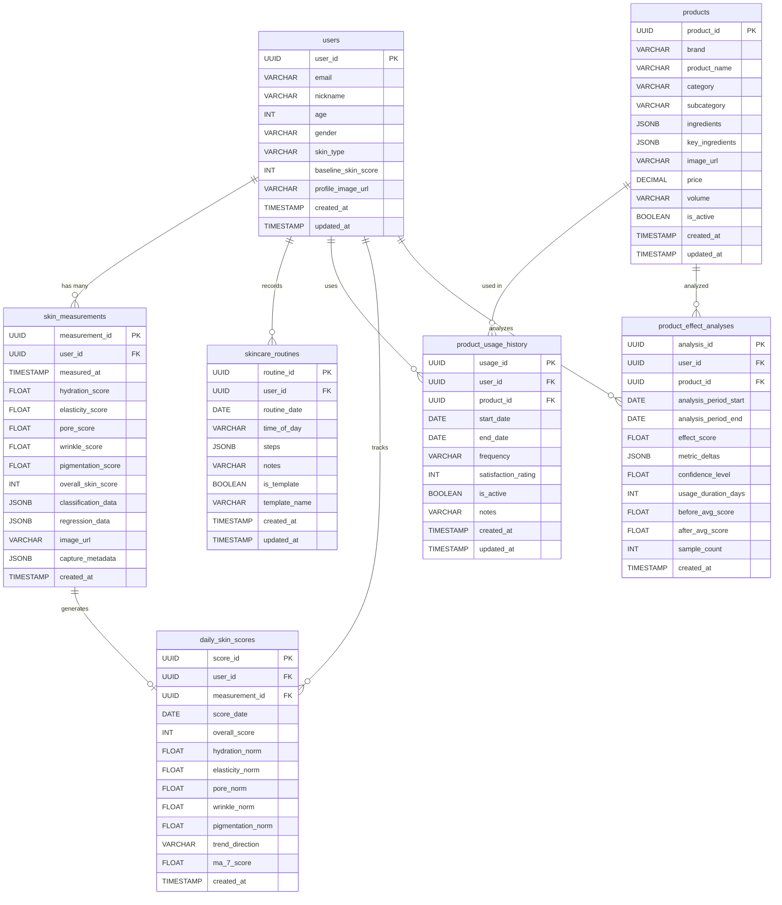

# 03. Data Model - 스킨케어 루틴 기록 & 데일리 피부 건강 트래킹

## 1. ERD (Entity-Relationship Diagram)

```
┌─────────────────────┐       ┌──────────────────────────────┐
│       users          │       │     skin_measurements         │
├─────────────────────┤       ├──────────────────────────────┤
│ PK user_id      UUID│───┐   │ PK measurement_id       UUID │
│    email     VARCHAR│   │   │ FK user_id              UUID │
│    nickname  VARCHAR│   ├──>│    measured_at      TIMESTAMP│
│    age          INT │   │   │    hydration_score    FLOAT  │
│    gender    VARCHAR│   │   │    elasticity_score   FLOAT  │
│    skin_type VARCHAR│   │   │    pore_score         FLOAT  │
│    baseline_score   │   │   │    wrinkle_score      FLOAT  │
│              INT    │   │   │    pigmentation_score  FLOAT │
│    profile_image_url│   │   │    overall_skin_score  INT   │
│           VARCHAR   │   │   │    classification_data JSONB │
│    created_at       │   │   │    regression_data     JSONB │
│         TIMESTAMP   │   │   │    image_url         VARCHAR │
│    updated_at       │   │   │    capture_metadata    JSONB │
│         TIMESTAMP   │   │   │    created_at      TIMESTAMP │
└─────────────────────┘   │   └──────────────────────────────┘
                          │
                          │   ┌──────────────────────────────┐
                          │   │     skincare_routines          │
                          │   ├──────────────────────────────┤
                          ├──>│ PK routine_id           UUID │
                          │   │ FK user_id              UUID │
                          │   │    routine_date         DATE │
                          │   │    time_of_day       VARCHAR │
                          │   │    steps               JSONB │
                          │   │    notes             VARCHAR │
                          │   │    is_template       BOOLEAN │
                          │   │    template_name     VARCHAR │
                          │   │    created_at      TIMESTAMP │
                          │   │    updated_at      TIMESTAMP │
                          │   └──────────────┬───────────────┘
                          │                  │
                          │                  │ (steps 내부에 product_id 참조)
                          │                  ▼
                          │   ┌──────────────────────────────┐
                          │   │        products               │
                          │   ├──────────────────────────────┤
                          │   │ PK product_id           UUID │
                          │   │    brand             VARCHAR │
                          │   │    product_name      VARCHAR │
                          │   │    category          VARCHAR │
                          │   │    subcategory       VARCHAR │
                          │   │    ingredients         JSONB │
                          │   │    key_ingredients     JSONB │
                          │   │    image_url         VARCHAR │
                          │   │    price             DECIMAL │
                          │   │    volume            VARCHAR │
                          │   │    is_active         BOOLEAN │
                          │   │    created_at      TIMESTAMP │
                          │   │    updated_at      TIMESTAMP │
                          │   └──────────────┬───────────────┘
                          │                  │
                          │                  │
                          │   ┌──────────────┴───────────────┐
                          │   │   product_usage_history       │
                          │   ├──────────────────────────────┤
                          └──>│ PK usage_id             UUID │
                              │ FK user_id              UUID │
                              │ FK product_id           UUID │
                              │    start_date           DATE │
                              │    end_date             DATE │
                              │    frequency         VARCHAR │
                              │    satisfaction_rating  INT  │
                              │    is_active         BOOLEAN │
                              │    notes             VARCHAR │
                              │    created_at      TIMESTAMP │
                              │    updated_at      TIMESTAMP │
                              └──────────────────────────────┘

추가 테이블:

┌──────────────────────────────┐   ┌──────────────────────────────┐
│   daily_skin_scores           │   │   product_effect_analyses     │
├──────────────────────────────┤   ├──────────────────────────────┤
│ PK score_id             UUID │   │ PK analysis_id          UUID │
│ FK user_id              UUID │   │ FK user_id              UUID │
│ FK measurement_id       UUID │   │ FK product_id           UUID │
│    score_date           DATE │   │    analysis_period_start DATE│
│    overall_score         INT │   │    analysis_period_end   DATE│
│    hydration_norm      FLOAT │   │    effect_score        FLOAT │
│    elasticity_norm     FLOAT │   │    metric_deltas        JSONB│
│    pore_norm           FLOAT │   │    confidence_level    FLOAT │
│    wrinkle_norm        FLOAT │   │    usage_duration_days   INT │
│    pigmentation_norm   FLOAT │   │    before_avg_score    FLOAT │
│    trend_direction   VARCHAR │   │    after_avg_score     FLOAT │
│    ma_7_score          FLOAT │   │    sample_count          INT │
│    created_at      TIMESTAMP │   │    created_at      TIMESTAMP │
└──────────────────────────────┘   └──────────────────────────────┘
```

### Mermaid ERD



---

## 2. 테이블 상세 스키마 (Table Schema Detail)

### 2.1 users (사용자 테이블)

사용자 기본 정보 및 피부 프로필을 저장한다. 온보딩 과정에서 수집되는 피부 유형과 기초 점수를 포함한다.

| 컬럼명 | 데이터 타입 | 제약조건 | 기본값 | 설명 |
|---|---|---|---|---|
| `user_id` | `UUID` | `PK, NOT NULL` | `gen_random_uuid()` | 사용자 고유 식별자 |
| `email` | `VARCHAR(255)` | `UNIQUE, NOT NULL` | - | 이메일 (로그인 ID) |
| `nickname` | `VARCHAR(50)` | `NOT NULL` | - | 닉네임 |
| `password_hash` | `VARCHAR(255)` | `NOT NULL` | - | 비밀번호 해시 (bcrypt) |
| `age` | `SMALLINT` | `CHECK(age >= 10 AND age <= 120)` | `NULL` | 나이 |
| `gender` | `VARCHAR(10)` | `CHECK(gender IN ('male','female','other'))` | `NULL` | 성별 |
| `skin_type` | `VARCHAR(20)` | `CHECK(skin_type IN ('dry','oily','combination','sensitive','normal'))` | `NULL` | 피부 유형 |
| `skin_concerns` | `JSONB` | - | `'[]'` | 피부 고민 목록 (예: ["wrinkle","pore"]) |
| `baseline_skin_score` | `SMALLINT` | `CHECK(baseline_skin_score >= 0 AND baseline_skin_score <= 100)` | `NULL` | 최초 측정 기준 점수 |
| `profile_image_url` | `VARCHAR(500)` | - | `NULL` | 프로필 이미지 URL |
| `notification_enabled` | `BOOLEAN` | `NOT NULL` | `TRUE` | 푸시 알림 수신 여부 |
| `created_at` | `TIMESTAMPTZ` | `NOT NULL` | `NOW()` | 계정 생성 일시 |
| `updated_at` | `TIMESTAMPTZ` | `NOT NULL` | `NOW()` | 최종 수정 일시 |

**DDL:**
```sql
CREATE TABLE users (
    user_id         UUID PRIMARY KEY DEFAULT gen_random_uuid(),
    email           VARCHAR(255) NOT NULL UNIQUE,
    nickname        VARCHAR(50)  NOT NULL,
    password_hash   VARCHAR(255) NOT NULL,
    age             SMALLINT CHECK (age >= 10 AND age <= 120),
    gender          VARCHAR(10)  CHECK (gender IN ('male', 'female', 'other')),
    skin_type       VARCHAR(20)  CHECK (skin_type IN ('dry', 'oily', 'combination', 'sensitive', 'normal')),
    skin_concerns   JSONB        DEFAULT '[]'::jsonb,
    baseline_skin_score SMALLINT CHECK (baseline_skin_score >= 0 AND baseline_skin_score <= 100),
    profile_image_url   VARCHAR(500),
    notification_enabled BOOLEAN NOT NULL DEFAULT TRUE,
    created_at      TIMESTAMPTZ  NOT NULL DEFAULT NOW(),
    updated_at      TIMESTAMPTZ  NOT NULL DEFAULT NOW()
);

CREATE INDEX idx_users_email ON users (email);
CREATE INDEX idx_users_skin_type ON users (skin_type);
```

---

### 2.2 skin_measurements (피부 측정 테이블)

AI 모델 분석을 통해 산출된 피부 측정 결과를 저장한다. **Skin Measurement Module**의 핵심 출력 테이블이다.

| 컬럼명 | 데이터 타입 | 제약조건 | 기본값 | 설명 |
|---|---|---|---|---|
| `measurement_id` | `UUID` | `PK, NOT NULL` | `gen_random_uuid()` | 측정 고유 ID |
| `user_id` | `UUID` | `FK(users), NOT NULL` | - | 사용자 ID |
| `measured_at` | `TIMESTAMPTZ` | `NOT NULL` | `NOW()` | 측정 일시 |
| `hydration_score` | `REAL` | `NOT NULL, CHECK(>= 0 AND <= 100)` | - | 수분 점수 (%) |
| `elasticity_score` | `REAL` | `NOT NULL, CHECK(>= 0 AND <= 1)` | - | 탄력 점수 (R2) |
| `pore_score` | `REAL` | `NOT NULL, CHECK(>= 0 AND <= 2600)` | - | 모공 점수 |
| `wrinkle_score` | `REAL` | `NOT NULL, CHECK(>= 0 AND <= 50)` | - | 주름 점수 (Ra) |
| `pigmentation_score` | `REAL` | `NOT NULL, CHECK(>= 0 AND <= 350)` | - | 색소침착 점수 (ITA) |
| `overall_skin_score` | `SMALLINT` | `NOT NULL, CHECK(>= 0 AND <= 100)` | - | 종합 피부 점수 |
| `classification_data` | `JSONB` | - | `NULL` | 부위별 분류 등급 데이터 |
| `regression_data` | `JSONB` | - | `NULL` | 부위별 회귀 예측 데이터 |
| `image_url` | `VARCHAR(500)` | - | `NULL` | 분석에 사용된 이미지 URL |
| `capture_metadata` | `JSONB` | - | `NULL` | 촬영 환경 메타데이터 |
| `created_at` | `TIMESTAMPTZ` | `NOT NULL` | `NOW()` | 레코드 생성 일시 |

**classification_data JSONB 구조:**
```json
{
  "full_face": {
    "wrinkle": { "grade": 2, "probabilities": [0.05, 0.15, 0.50, 0.20, 0.07, 0.02, 0.01] },
    "pigmentation": { "grade": 1, "probabilities": [0.10, 0.60, 0.20, 0.05, 0.03, 0.02] },
    "pore": { "grade": 3, "probabilities": [0.02, 0.08, 0.15, 0.45, 0.20, 0.10] },
    "sagging": { "grade": 1, "probabilities": [0.15, 0.55, 0.20, 0.05, 0.03, 0.02] },
    "dryness": { "grade": 2, "probabilities": [0.05, 0.20, 0.50, 0.15, 0.10] }
  },
  "forehead": { ... },
  "left_cheek": { ... },
  ...
}
```

**regression_data JSONB 구조:**
```json
{
  "full_face": {
    "moisture": { "value": 62.5 },
    "elasticity_R2": { "value": 0.78 },
    "wrinkle_Ra": { "value": 12.3 },
    "pore": { "value": 850 },
    "pigmentation": { "value": 125.0 }
  },
  "forehead": { ... },
  ...
}
```

**DDL:**
```sql
CREATE TABLE skin_measurements (
    measurement_id      UUID PRIMARY KEY DEFAULT gen_random_uuid(),
    user_id             UUID NOT NULL REFERENCES users(user_id) ON DELETE CASCADE,
    measured_at         TIMESTAMPTZ NOT NULL DEFAULT NOW(),
    hydration_score     REAL NOT NULL CHECK (hydration_score >= 0 AND hydration_score <= 100),
    elasticity_score    REAL NOT NULL CHECK (elasticity_score >= 0 AND elasticity_score <= 1),
    pore_score          REAL NOT NULL CHECK (pore_score >= 0 AND pore_score <= 2600),
    wrinkle_score       REAL NOT NULL CHECK (wrinkle_score >= 0 AND wrinkle_score <= 50),
    pigmentation_score  REAL NOT NULL CHECK (pigmentation_score >= 0 AND pigmentation_score <= 350),
    overall_skin_score  SMALLINT NOT NULL CHECK (overall_skin_score >= 0 AND overall_skin_score <= 100),
    classification_data JSONB,
    regression_data     JSONB,
    image_url           VARCHAR(500),
    capture_metadata    JSONB,
    created_at          TIMESTAMPTZ NOT NULL DEFAULT NOW()
);

-- 사용자별 최신 측정 조회용
CREATE INDEX idx_skin_measurements_user_date ON skin_measurements (user_id, measured_at DESC);

-- 기간별 측정 데이터 조회용
CREATE INDEX idx_skin_measurements_measured_at ON skin_measurements (measured_at);

-- 종합 점수 기반 필터링용
CREATE INDEX idx_skin_measurements_overall_score ON skin_measurements (user_id, overall_skin_score);
```

---

### 2.3 skincare_routines (스킨케어 루틴 테이블)

사용자의 아침/저녁 스킨케어 루틴 기록을 저장한다. **Skincare Routine Tracker**의 핵심 테이블이다. 루틴 단계(steps)는 JSONB로 저장하여 유연한 구조를 지원한다.

| 컬럼명 | 데이터 타입 | 제약조건 | 기본값 | 설명 |
|---|---|---|---|---|
| `routine_id` | `UUID` | `PK, NOT NULL` | `gen_random_uuid()` | 루틴 기록 고유 ID |
| `user_id` | `UUID` | `FK(users), NOT NULL` | - | 사용자 ID |
| `routine_date` | `DATE` | `NOT NULL` | `CURRENT_DATE` | 루틴 기록 날짜 |
| `time_of_day` | `VARCHAR(10)` | `NOT NULL, CHECK IN ('morning','night')` | - | 아침/저녁 구분 |
| `steps` | `JSONB` | `NOT NULL` | `'[]'` | 루틴 단계 배열 |
| `notes` | `TEXT` | - | `NULL` | 메모 (피부 특이사항 등) |
| `is_template` | `BOOLEAN` | `NOT NULL` | `FALSE` | 템플릿 여부 |
| `template_name` | `VARCHAR(100)` | - | `NULL` | 템플릿 이름 (is_template=true 시) |
| `total_products` | `SMALLINT` | - | `0` | 사용 제품 수 (계산 필드) |
| `created_at` | `TIMESTAMPTZ` | `NOT NULL` | `NOW()` | 레코드 생성 일시 |
| `updated_at` | `TIMESTAMPTZ` | `NOT NULL` | `NOW()` | 최종 수정 일시 |

**steps JSONB 구조:**
```json
[
  {
    "order": 1,
    "category": "cleanser",
    "product_id": "550e8400-e29b-41d4-a716-446655440001",
    "product_name": "이니스프리 그린티 폼 클렌저",
    "amount": "1 pump",
    "duration_seconds": 60,
    "notes": "미온수로 거품 세안"
  },
  {
    "order": 2,
    "category": "toner",
    "product_id": "550e8400-e29b-41d4-a716-446655440002",
    "product_name": "코스알엑스 AHA/BHA 토너",
    "amount": "화장솜 1장",
    "duration_seconds": null,
    "notes": null
  },
  {
    "order": 3,
    "category": "serum",
    "product_id": null,
    "product_name": "직접 입력한 세럼",
    "amount": "2-3 drops",
    "duration_seconds": null,
    "notes": null
  }
]
```

**category 허용 값:**
| 카테고리 | 한국어 | 일반적 순서 |
|---|---|---|
| `cleanser` | 클렌저 | 1 |
| `toner` | 토너 | 2 |
| `essence` | 에센스 | 3 |
| `serum` | 세럼 | 4 |
| `ampoule` | 앰플 | 5 |
| `cream` | 크림 | 6 |
| `eye_cream` | 아이크림 | 7 |
| `sunscreen` | 선크림 | 8 |
| `mask` | 마스크팩 | 9 |
| `other` | 기타 | 10 |

**DDL:**
```sql
CREATE TABLE skincare_routines (
    routine_id      UUID PRIMARY KEY DEFAULT gen_random_uuid(),
    user_id         UUID NOT NULL REFERENCES users(user_id) ON DELETE CASCADE,
    routine_date    DATE NOT NULL DEFAULT CURRENT_DATE,
    time_of_day     VARCHAR(10) NOT NULL CHECK (time_of_day IN ('morning', 'night')),
    steps           JSONB NOT NULL DEFAULT '[]'::jsonb,
    notes           TEXT,
    is_template     BOOLEAN NOT NULL DEFAULT FALSE,
    template_name   VARCHAR(100),
    total_products  SMALLINT DEFAULT 0,
    created_at      TIMESTAMPTZ NOT NULL DEFAULT NOW(),
    updated_at      TIMESTAMPTZ NOT NULL DEFAULT NOW(),

    -- 동일 사용자의 같은 날짜, 같은 시간대에 중복 기록 방지
    CONSTRAINT uq_routine_user_date_time UNIQUE (user_id, routine_date, time_of_day)
);

-- 사용자별 날짜 조회용 (루틴 기록 달력)
CREATE INDEX idx_routines_user_date ON skincare_routines (user_id, routine_date DESC);

-- 템플릿 조회용
CREATE INDEX idx_routines_template ON skincare_routines (user_id, is_template) WHERE is_template = TRUE;

-- steps 내부 product_id 검색용 (GIN 인덱스)
CREATE INDEX idx_routines_steps_products ON skincare_routines USING GIN (steps jsonb_path_ops);
```

---

### 2.4 products (제품 테이블)

화장품 제품의 마스터 데이터를 저장한다. 브랜드, 성분, 카테고리 등 제품 정보를 관리하며, **Product Effect Analysis Engine**에서 성분 기반 분석에 활용된다.

| 컬럼명 | 데이터 타입 | 제약조건 | 기본값 | 설명 |
|---|---|---|---|---|
| `product_id` | `UUID` | `PK, NOT NULL` | `gen_random_uuid()` | 제품 고유 ID |
| `brand` | `VARCHAR(100)` | `NOT NULL` | - | 브랜드명 |
| `product_name` | `VARCHAR(255)` | `NOT NULL` | - | 제품명 |
| `category` | `VARCHAR(50)` | `NOT NULL` | - | 제품 카테고리 (cleanser, toner 등) |
| `subcategory` | `VARCHAR(50)` | - | `NULL` | 하위 카테고리 |
| `ingredients` | `JSONB` | - | `'[]'` | 전성분 목록 |
| `key_ingredients` | `JSONB` | - | `'[]'` | 주요 성분 목록 |
| `image_url` | `VARCHAR(500)` | - | `NULL` | 제품 이미지 URL |
| `price` | `DECIMAL(10,0)` | `CHECK(price >= 0)` | `NULL` | 가격 (원) |
| `volume` | `VARCHAR(50)` | - | `NULL` | 용량 (예: "200ml") |
| `description` | `TEXT` | - | `NULL` | 제품 설명 |
| `is_active` | `BOOLEAN` | `NOT NULL` | `TRUE` | 활성 상태 (단종 여부) |
| `created_at` | `TIMESTAMPTZ` | `NOT NULL` | `NOW()` | 레코드 생성 일시 |
| `updated_at` | `TIMESTAMPTZ` | `NOT NULL` | `NOW()` | 최종 수정 일시 |

**ingredients JSONB 구조:**
```json
[
  {
    "name_ko": "나이아신아마이드",
    "name_en": "Niacinamide",
    "name_inci": "NIACINAMIDE",
    "order": 1,
    "concentration_pct": 5.0
  },
  {
    "name_ko": "히알루론산",
    "name_en": "Hyaluronic Acid",
    "name_inci": "SODIUM HYALURONATE",
    "order": 2,
    "concentration_pct": null
  }
]
```

**key_ingredients JSONB 구조:**
```json
[
  {
    "name_ko": "나이아신아마이드",
    "name_en": "Niacinamide",
    "benefit": "미백, 모공 축소",
    "target_concerns": ["pigmentation", "pore"]
  },
  {
    "name_ko": "레티놀",
    "name_en": "Retinol",
    "benefit": "주름 개선, 탄력 강화",
    "target_concerns": ["wrinkle", "sagging"]
  }
]
```

**DDL:**
```sql
CREATE TABLE products (
    product_id      UUID PRIMARY KEY DEFAULT gen_random_uuid(),
    brand           VARCHAR(100) NOT NULL,
    product_name    VARCHAR(255) NOT NULL,
    category        VARCHAR(50)  NOT NULL,
    subcategory     VARCHAR(50),
    ingredients     JSONB DEFAULT '[]'::jsonb,
    key_ingredients JSONB DEFAULT '[]'::jsonb,
    image_url       VARCHAR(500),
    price           DECIMAL(10, 0) CHECK (price >= 0),
    volume          VARCHAR(50),
    description     TEXT,
    is_active       BOOLEAN NOT NULL DEFAULT TRUE,
    created_at      TIMESTAMPTZ NOT NULL DEFAULT NOW(),
    updated_at      TIMESTAMPTZ NOT NULL DEFAULT NOW()
);

-- 브랜드 + 제품명 복합 검색용
CREATE INDEX idx_products_brand_name ON products (brand, product_name);

-- 카테고리 필터링용
CREATE INDEX idx_products_category ON products (category);

-- 제품명 텍스트 검색용 (trigram)
CREATE EXTENSION IF NOT EXISTS pg_trgm;
CREATE INDEX idx_products_name_trgm ON products USING GIN (product_name gin_trgm_ops);

-- 주요 성분 기반 검색용
CREATE INDEX idx_products_key_ingredients ON products USING GIN (key_ingredients jsonb_path_ops);

-- 활성 제품만 필터링
CREATE INDEX idx_products_active ON products (is_active) WHERE is_active = TRUE;
```

---

### 2.5 product_usage_history (제품 사용 이력 테이블)

사용자별 제품 사용 기간을 추적한다. **Product Effect Analysis Engine**에서 제품 사용 기간과 피부 변화를 교차 분석할 때 핵심 조인 테이블로 사용된다.

| 컬럼명 | 데이터 타입 | 제약조건 | 기본값 | 설명 |
|---|---|---|---|---|
| `usage_id` | `UUID` | `PK, NOT NULL` | `gen_random_uuid()` | 사용 이력 고유 ID |
| `user_id` | `UUID` | `FK(users), NOT NULL` | - | 사용자 ID |
| `product_id` | `UUID` | `FK(products), NOT NULL` | - | 제품 ID |
| `start_date` | `DATE` | `NOT NULL` | - | 사용 시작일 |
| `end_date` | `DATE` | - | `NULL` | 사용 종료일 (NULL = 현재 사용 중) |
| `frequency` | `VARCHAR(20)` | `CHECK IN ('daily','weekly','occasional')` | `'daily'` | 사용 빈도 |
| `time_of_day` | `VARCHAR(10)` | `CHECK IN ('morning','night','both')` | `'both'` | 사용 시간대 |
| `satisfaction_rating` | `SMALLINT` | `CHECK(>= 1 AND <= 5)` | `NULL` | 만족도 (1~5점) |
| `is_active` | `BOOLEAN` | `NOT NULL` | `TRUE` | 현재 사용 중 여부 |
| `notes` | `TEXT` | - | `NULL` | 메모 |
| `created_at` | `TIMESTAMPTZ` | `NOT NULL` | `NOW()` | 레코드 생성 일시 |
| `updated_at` | `TIMESTAMPTZ` | `NOT NULL` | `NOW()` | 최종 수정 일시 |

**DDL:**
```sql
CREATE TABLE product_usage_history (
    usage_id            UUID PRIMARY KEY DEFAULT gen_random_uuid(),
    user_id             UUID NOT NULL REFERENCES users(user_id) ON DELETE CASCADE,
    product_id          UUID NOT NULL REFERENCES products(product_id) ON DELETE RESTRICT,
    start_date          DATE NOT NULL,
    end_date            DATE,
    frequency           VARCHAR(20) DEFAULT 'daily' CHECK (frequency IN ('daily', 'weekly', 'occasional')),
    time_of_day         VARCHAR(10) DEFAULT 'both' CHECK (time_of_day IN ('morning', 'night', 'both')),
    satisfaction_rating SMALLINT CHECK (satisfaction_rating >= 1 AND satisfaction_rating <= 5),
    is_active           BOOLEAN NOT NULL DEFAULT TRUE,
    notes               TEXT,
    created_at          TIMESTAMPTZ NOT NULL DEFAULT NOW(),
    updated_at          TIMESTAMPTZ NOT NULL DEFAULT NOW(),

    -- 종료일은 시작일 이후여야 함
    CONSTRAINT chk_date_range CHECK (end_date IS NULL OR end_date >= start_date)
);

-- 사용자의 현재 사용 중인 제품 조회용
CREATE INDEX idx_usage_user_active ON product_usage_history (user_id, is_active) WHERE is_active = TRUE;

-- 사용자 + 제품 조합 조회용
CREATE INDEX idx_usage_user_product ON product_usage_history (user_id, product_id);

-- 기간 겹침 검사용 (제품 효과 분석 시)
CREATE INDEX idx_usage_date_range ON product_usage_history (user_id, start_date, end_date);

-- 제품별 사용자 통계 조회용
CREATE INDEX idx_usage_product ON product_usage_history (product_id, is_active);
```

---

### 2.6 daily_skin_scores (일일 피부 점수 테이블)

**Daily Skin Score Tracking** 모듈의 핵심 테이블. 일일 측정 결과를 정규화하여 저장하고, 이동 평균 및 추세 정보를 사전 계산하여 저장한다.

| 컬럼명 | 데이터 타입 | 제약조건 | 기본값 | 설명 |
|---|---|---|---|---|
| `score_id` | `UUID` | `PK, NOT NULL` | `gen_random_uuid()` | 점수 기록 고유 ID |
| `user_id` | `UUID` | `FK(users), NOT NULL` | - | 사용자 ID |
| `measurement_id` | `UUID` | `FK(skin_measurements)` | `NULL` | 원본 측정 ID |
| `score_date` | `DATE` | `NOT NULL` | - | 점수 기록 날짜 |
| `overall_score` | `SMALLINT` | `NOT NULL, CHECK(0~100)` | - | 종합 피부 점수 |
| `hydration_norm` | `REAL` | `CHECK(0~1)` | - | 수분 정규화 점수 |
| `elasticity_norm` | `REAL` | `CHECK(0~1)` | - | 탄력 정규화 점수 |
| `pore_norm` | `REAL` | `CHECK(0~1)` | - | 모공 정규화 점수 |
| `wrinkle_norm` | `REAL` | `CHECK(0~1)` | - | 주름 정규화 점수 |
| `pigmentation_norm` | `REAL` | `CHECK(0~1)` | - | 색소침착 정규화 점수 |
| `trend_direction` | `VARCHAR(20)` | `CHECK IN ('improving','stable','declining')` | `NULL` | 추세 방향 |
| `trend_velocity` | `REAL` | - | `NULL` | 추세 속도 (점/주) |
| `ma_7_score` | `REAL` | - | `NULL` | 7일 이동 평균 점수 |
| `is_anomaly` | `BOOLEAN` | `NOT NULL` | `FALSE` | 이상치 여부 |
| `created_at` | `TIMESTAMPTZ` | `NOT NULL` | `NOW()` | 레코드 생성 일시 |

**DDL:**
```sql
CREATE TABLE daily_skin_scores (
    score_id            UUID PRIMARY KEY DEFAULT gen_random_uuid(),
    user_id             UUID NOT NULL REFERENCES users(user_id) ON DELETE CASCADE,
    measurement_id      UUID REFERENCES skin_measurements(measurement_id) ON DELETE SET NULL,
    score_date          DATE NOT NULL,
    overall_score       SMALLINT NOT NULL CHECK (overall_score >= 0 AND overall_score <= 100),
    hydration_norm      REAL CHECK (hydration_norm >= 0 AND hydration_norm <= 1),
    elasticity_norm     REAL CHECK (elasticity_norm >= 0 AND elasticity_norm <= 1),
    pore_norm           REAL CHECK (pore_norm >= 0 AND pore_norm <= 1),
    wrinkle_norm        REAL CHECK (wrinkle_norm >= 0 AND wrinkle_norm <= 1),
    pigmentation_norm   REAL CHECK (pigmentation_norm >= 0 AND pigmentation_norm <= 1),
    trend_direction     VARCHAR(20) CHECK (trend_direction IN ('improving', 'stable', 'declining')),
    trend_velocity      REAL,
    ma_7_score          REAL,
    is_anomaly          BOOLEAN NOT NULL DEFAULT FALSE,
    created_at          TIMESTAMPTZ NOT NULL DEFAULT NOW(),

    -- 사용자 당 하루에 하나의 점수 기록
    CONSTRAINT uq_daily_score_user_date UNIQUE (user_id, score_date)
);

-- 시계열 조회용 (차트 데이터)
CREATE INDEX idx_daily_scores_user_date ON daily_skin_scores (user_id, score_date DESC);

-- 추세 필터링용
CREATE INDEX idx_daily_scores_trend ON daily_skin_scores (user_id, trend_direction);

-- 이상치 조회용
CREATE INDEX idx_daily_scores_anomaly ON daily_skin_scores (user_id, is_anomaly) WHERE is_anomaly = TRUE;
```

---

### 2.7 product_effect_analyses (제품 효과 분석 테이블)

**Product Effect Analysis Engine**의 분석 결과를 저장한다. 배치 분석 또는 사용자 요청에 의해 생성된다.

| 컬럼명 | 데이터 타입 | 제약조건 | 기본값 | 설명 |
|---|---|---|---|---|
| `analysis_id` | `UUID` | `PK, NOT NULL` | `gen_random_uuid()` | 분석 결과 고유 ID |
| `user_id` | `UUID` | `FK(users), NOT NULL` | - | 사용자 ID |
| `product_id` | `UUID` | `FK(products), NOT NULL` | - | 분석 대상 제품 ID |
| `analysis_period_start` | `DATE` | `NOT NULL` | - | 분석 기간 시작일 |
| `analysis_period_end` | `DATE` | `NOT NULL` | - | 분석 기간 종료일 |
| `effect_score` | `REAL` | `NOT NULL, CHECK(-100~100)` | - | 종합 효과 점수 |
| `metric_deltas` | `JSONB` | `NOT NULL` | - | 지표별 변화량 |
| `confidence_level` | `REAL` | `NOT NULL, CHECK(0~1)` | - | 분석 신뢰도 |
| `usage_duration_days` | `INT` | `NOT NULL` | - | 사용 기간 (일) |
| `before_avg_score` | `REAL` | - | - | 사용 전 평균 점수 |
| `after_avg_score` | `REAL` | - | - | 사용 후 평균 점수 |
| `sample_count` | `INT` | `NOT NULL` | - | 분석에 사용된 측정 샘플 수 |
| `analysis_version` | `VARCHAR(10)` | `NOT NULL` | `'1.0'` | 분석 알고리즘 버전 |
| `created_at` | `TIMESTAMPTZ` | `NOT NULL` | `NOW()` | 분석 실행 일시 |

**metric_deltas JSONB 구조:**
```json
{
  "hydration": {
    "before_avg": 55.2,
    "after_avg": 62.8,
    "delta": 7.6,
    "normalized_delta": 0.076,
    "direction": "improved"
  },
  "elasticity": {
    "before_avg": 0.65,
    "after_avg": 0.72,
    "delta": 0.07,
    "normalized_delta": 0.07,
    "direction": "improved"
  },
  "pore": {
    "before_avg": 1200,
    "after_avg": 1050,
    "delta": -150,
    "normalized_delta": 0.058,
    "direction": "improved"
  },
  "wrinkle": {
    "before_avg": 18.5,
    "after_avg": 17.2,
    "delta": -1.3,
    "normalized_delta": 0.026,
    "direction": "improved"
  },
  "pigmentation": {
    "before_avg": 145,
    "after_avg": 155,
    "delta": 10,
    "normalized_delta": 0.029,
    "direction": "improved"
  }
}
```

**DDL:**
```sql
CREATE TABLE product_effect_analyses (
    analysis_id          UUID PRIMARY KEY DEFAULT gen_random_uuid(),
    user_id              UUID NOT NULL REFERENCES users(user_id) ON DELETE CASCADE,
    product_id           UUID NOT NULL REFERENCES products(product_id) ON DELETE RESTRICT,
    analysis_period_start DATE NOT NULL,
    analysis_period_end  DATE NOT NULL,
    effect_score         REAL NOT NULL CHECK (effect_score >= -100 AND effect_score <= 100),
    metric_deltas        JSONB NOT NULL,
    confidence_level     REAL NOT NULL CHECK (confidence_level >= 0 AND confidence_level <= 1),
    usage_duration_days  INT NOT NULL,
    before_avg_score     REAL,
    after_avg_score      REAL,
    sample_count         INT NOT NULL,
    analysis_version     VARCHAR(10) NOT NULL DEFAULT '1.0',
    created_at           TIMESTAMPTZ NOT NULL DEFAULT NOW(),

    -- 분석 기간 유효성
    CONSTRAINT chk_analysis_period CHECK (analysis_period_end >= analysis_period_start)
);

-- 사용자별 제품 효과 조회용
CREATE INDEX idx_effect_user_product ON product_effect_analyses (user_id, product_id);

-- 최신 분석 결과 조회용
CREATE INDEX idx_effect_user_date ON product_effect_analyses (user_id, created_at DESC);

-- 효과 점수 랭킹 조회용
CREATE INDEX idx_effect_user_score ON product_effect_analyses (user_id, effect_score DESC);

-- 제품별 전체 사용자 효과 통계용
CREATE INDEX idx_effect_product ON product_effect_analyses (product_id, effect_score);
```

---

## 3. 테이블 관계 요약 (Relationship Summary)

| 관계 | 타입 | FK | ON DELETE | 설명 |
|---|---|---|---|---|
| users → skin_measurements | 1:N | `user_id` | `CASCADE` | 사용자당 다수 측정 |
| users → skincare_routines | 1:N | `user_id` | `CASCADE` | 사용자당 다수 루틴 |
| users → product_usage_history | 1:N | `user_id` | `CASCADE` | 사용자당 다수 사용이력 |
| users → daily_skin_scores | 1:N | `user_id` | `CASCADE` | 사용자당 일일 점수 |
| users → product_effect_analyses | 1:N | `user_id` | `CASCADE` | 사용자당 다수 분석 |
| products → product_usage_history | 1:N | `product_id` | `RESTRICT` | 제품당 다수 사용이력 |
| products → product_effect_analyses | 1:N | `product_id` | `RESTRICT` | 제품당 다수 분석 |
| skin_measurements → daily_skin_scores | 1:1 | `measurement_id` | `SET NULL` | 측정당 일일 점수 |

**삭제 정책:**
- `CASCADE`: 사용자 탈퇴 시 관련 데이터 모두 삭제
- `RESTRICT`: 사용 이력이 있는 제품은 삭제 불가 (is_active=false로 비활성화)
- `SET NULL`: 측정 데이터 삭제 시 일일 점수의 참조만 해제

---

## 4. 인덱스 전략 (Indexing Strategy)

### 4.1 인덱스 목록 전체

| 테이블 | 인덱스명 | 컬럼 | 타입 | 용도 |
|---|---|---|---|---|
| `users` | `idx_users_email` | `email` | B-tree | 로그인 조회 |
| `users` | `idx_users_skin_type` | `skin_type` | B-tree | 피부 유형 필터 |
| `skin_measurements` | `idx_skin_measurements_user_date` | `user_id, measured_at DESC` | B-tree | 최신 측정 조회 |
| `skin_measurements` | `idx_skin_measurements_measured_at` | `measured_at` | B-tree | 기간별 조회 |
| `skin_measurements` | `idx_skin_measurements_overall_score` | `user_id, overall_skin_score` | B-tree | 점수 필터 |
| `skincare_routines` | `idx_routines_user_date` | `user_id, routine_date DESC` | B-tree | 날짜별 루틴 |
| `skincare_routines` | `idx_routines_template` | `user_id, is_template` | Partial B-tree | 템플릿 조회 |
| `skincare_routines` | `idx_routines_steps_products` | `steps` | GIN | JSONB 제품 검색 |
| `products` | `idx_products_brand_name` | `brand, product_name` | B-tree | 브랜드+제품명 검색 |
| `products` | `idx_products_category` | `category` | B-tree | 카테고리 필터 |
| `products` | `idx_products_name_trgm` | `product_name` | GIN (trigram) | 유사 검색 |
| `products` | `idx_products_key_ingredients` | `key_ingredients` | GIN | 성분 검색 |
| `products` | `idx_products_active` | `is_active` | Partial B-tree | 활성 제품 |
| `product_usage_history` | `idx_usage_user_active` | `user_id, is_active` | Partial B-tree | 현재 사용 제품 |
| `product_usage_history` | `idx_usage_user_product` | `user_id, product_id` | B-tree | 사용자-제품 조회 |
| `product_usage_history` | `idx_usage_date_range` | `user_id, start_date, end_date` | B-tree | 기간 겹침 검사 |
| `product_usage_history` | `idx_usage_product` | `product_id, is_active` | B-tree | 제품별 통계 |
| `daily_skin_scores` | `idx_daily_scores_user_date` | `user_id, score_date DESC` | B-tree | 시계열 조회 |
| `daily_skin_scores` | `idx_daily_scores_trend` | `user_id, trend_direction` | B-tree | 추세 필터 |
| `daily_skin_scores` | `idx_daily_scores_anomaly` | `user_id, is_anomaly` | Partial B-tree | 이상치 조회 |
| `product_effect_analyses` | `idx_effect_user_product` | `user_id, product_id` | B-tree | 사용자-제품 효과 |
| `product_effect_analyses` | `idx_effect_user_date` | `user_id, created_at DESC` | B-tree | 최신 분석 |
| `product_effect_analyses` | `idx_effect_user_score` | `user_id, effect_score DESC` | B-tree | 효과 랭킹 |
| `product_effect_analyses` | `idx_effect_product` | `product_id, effect_score` | B-tree | 제품별 효과 통계 |

### 4.2 인덱스 설계 원칙

1. **복합 인덱스 우선**: 자주 함께 조회되는 컬럼은 복합 인덱스로 구성 (예: `user_id + date`)
2. **Partial Index 활용**: 특정 조건의 서브셋만 필요한 경우 WHERE 절 포함 (예: `is_active = TRUE`)
3. **GIN 인덱스**: JSONB 컬럼의 내부 경로 검색에 `jsonb_path_ops` 사용
4. **Trigram**: 제품명 유사 검색(`LIKE '%키워드%'`)에 `pg_trgm` 확장 활용
5. **DESC 정렬**: 최신 데이터 우선 조회 패턴에 내림차순 인덱스 적용

---

## 5. 주요 쿼리 패턴 (Key Query Patterns)

### 5.1 사용자의 최근 7일 피부 점수 추이

```sql
SELECT score_date, overall_score, ma_7_score, trend_direction,
       hydration_norm, elasticity_norm, pore_norm, wrinkle_norm, pigmentation_norm
FROM daily_skin_scores
WHERE user_id = :user_id
  AND score_date >= CURRENT_DATE - INTERVAL '7 days'
ORDER BY score_date ASC;
```

### 5.2 특정 날짜의 루틴 + 사용 제품 조회

```sql
SELECT r.routine_id, r.time_of_day, r.steps, r.notes,
       r.created_at
FROM skincare_routines r
WHERE r.user_id = :user_id
  AND r.routine_date = :target_date
  AND r.is_template = FALSE
ORDER BY r.time_of_day;
```

### 5.3 특정 제품의 효과 분석 (최신)

```sql
SELECT a.effect_score, a.metric_deltas, a.confidence_level,
       a.usage_duration_days, a.before_avg_score, a.after_avg_score,
       p.product_name, p.brand, p.key_ingredients
FROM product_effect_analyses a
JOIN products p ON a.product_id = p.product_id
WHERE a.user_id = :user_id
  AND a.product_id = :product_id
ORDER BY a.created_at DESC
LIMIT 1;
```

### 5.4 사용자의 제품 효과 랭킹

```sql
SELECT DISTINCT ON (a.product_id)
       a.product_id, p.product_name, p.brand, p.category,
       a.effect_score, a.confidence_level, a.usage_duration_days
FROM product_effect_analyses a
JOIN products p ON a.product_id = p.product_id
WHERE a.user_id = :user_id
  AND a.confidence_level >= 0.5
ORDER BY a.product_id, a.created_at DESC;

-- 위 결과를 effect_score DESC로 정렬 (서브쿼리 또는 CTE)
```

### 5.5 제품 사용 기간과 피부 점수 교차 분석

```sql
WITH usage_period AS (
    SELECT start_date, COALESCE(end_date, CURRENT_DATE) AS end_date
    FROM product_usage_history
    WHERE user_id = :user_id AND product_id = :product_id
    ORDER BY start_date DESC LIMIT 1
),
before_scores AS (
    SELECT AVG(overall_score) AS avg_score, COUNT(*) AS cnt
    FROM daily_skin_scores
    WHERE user_id = :user_id
      AND score_date >= (SELECT start_date - INTERVAL '14 days' FROM usage_period)
      AND score_date < (SELECT start_date FROM usage_period)
),
after_scores AS (
    SELECT AVG(overall_score) AS avg_score, COUNT(*) AS cnt
    FROM daily_skin_scores
    WHERE user_id = :user_id
      AND score_date >= (SELECT start_date FROM usage_period)
      AND score_date <= (SELECT end_date FROM usage_period)
)
SELECT
    b.avg_score AS before_avg,
    a.avg_score AS after_avg,
    a.avg_score - b.avg_score AS delta,
    b.cnt AS before_samples,
    a.cnt AS after_samples
FROM before_scores b, after_scores a;
```

### 5.6 월간 루틴 기록 히트맵 데이터

```sql
SELECT routine_date, time_of_day, total_products
FROM skincare_routines
WHERE user_id = :user_id
  AND routine_date >= DATE_TRUNC('month', :target_date::date)
  AND routine_date < DATE_TRUNC('month', :target_date::date) + INTERVAL '1 month'
  AND is_template = FALSE
ORDER BY routine_date, time_of_day;
```

---

## 6. 데이터 무결성 규칙 (Data Integrity Rules)

### 6.1 제약 조건 요약

| 규칙 | 구현 방법 | 설명 |
|---|---|---|
| 하루 최대 1개 종합 점수 | `UNIQUE(user_id, score_date)` | daily_skin_scores 중복 방지 |
| 동일 날짜/시간 루틴 중복 방지 | `UNIQUE(user_id, routine_date, time_of_day)` | 아침/저녁 각 1회 |
| 사용 종료일 >= 시작일 | `CHECK(end_date >= start_date)` | 기간 논리 검증 |
| 피부 점수 범위 | `CHECK(0 <= score <= 100)` | 점수 범위 검증 |
| 사용 중인 제품 삭제 불가 | `ON DELETE RESTRICT` | 참조 무결성 보호 |
| 사용자 탈퇴 시 데이터 삭제 | `ON DELETE CASCADE` | GDPR/개인정보 준수 |

### 6.2 트리거 (Triggers)

```sql
-- updated_at 자동 갱신 트리거
CREATE OR REPLACE FUNCTION update_updated_at_column()
RETURNS TRIGGER AS $$
BEGIN
    NEW.updated_at = NOW();
    RETURN NEW;
END;
$$ LANGUAGE plpgsql;

-- 각 테이블에 적용
CREATE TRIGGER trg_users_updated_at
    BEFORE UPDATE ON users
    FOR EACH ROW EXECUTE FUNCTION update_updated_at_column();

CREATE TRIGGER trg_routines_updated_at
    BEFORE UPDATE ON skincare_routines
    FOR EACH ROW EXECUTE FUNCTION update_updated_at_column();

CREATE TRIGGER trg_products_updated_at
    BEFORE UPDATE ON products
    FOR EACH ROW EXECUTE FUNCTION update_updated_at_column();

CREATE TRIGGER trg_usage_updated_at
    BEFORE UPDATE ON product_usage_history
    FOR EACH ROW EXECUTE FUNCTION update_updated_at_column();
```

```sql
-- 루틴 저장 시 total_products 자동 계산 트리거
CREATE OR REPLACE FUNCTION calculate_total_products()
RETURNS TRIGGER AS $$
BEGIN
    NEW.total_products = jsonb_array_length(COALESCE(NEW.steps, '[]'::jsonb));
    RETURN NEW;
END;
$$ LANGUAGE plpgsql;

CREATE TRIGGER trg_routines_total_products
    BEFORE INSERT OR UPDATE OF steps ON skincare_routines
    FOR EACH ROW EXECUTE FUNCTION calculate_total_products();
```

---

## 7. 데이터 마이그레이션 전략 (Migration Strategy)

### 7.1 마이그레이션 순서

Alembic을 사용한 순차적 마이그레이션:

```
001_create_users_table.py
002_create_products_table.py
003_create_skin_measurements_table.py
004_create_skincare_routines_table.py
005_create_product_usage_history_table.py
006_create_daily_skin_scores_table.py
007_create_product_effect_analyses_table.py
008_create_indexes.py
009_create_triggers.py
010_seed_product_categories.py
```

### 7.2 시드 데이터 (Seed Data)

**제품 카테고리 기본 데이터:**
```sql
INSERT INTO products (brand, product_name, category, subcategory, key_ingredients, is_active) VALUES
('이니스프리', '그린티 씨드 세럼', 'serum', 'hydrating',
 '[{"name_ko":"녹차 씨앗 오일","name_en":"Green Tea Seed Oil","benefit":"보습, 항산화","target_concerns":["dryness"]}]'::jsonb,
 TRUE),
('코스알엑스', 'AHA/BHA 클래리파잉 트리트먼트 토너', 'toner', 'exfoliating',
 '[{"name_ko":"글리콜산","name_en":"Glycolic Acid","benefit":"각질 제거, 모공 관리","target_concerns":["pore","pigmentation"]}]'::jsonb,
 TRUE);
-- ... 추가 시드 데이터
```

---

## 8. 성능 최적화 고려 사항 (Performance Considerations)

### 8.1 파티셔닝 전략 (Phase 3 확장 시)

대용량 데이터 발생 시 시계열 테이블에 Range Partitioning 적용:

```sql
-- daily_skin_scores를 월별 파티셔닝
CREATE TABLE daily_skin_scores (
    ...
) PARTITION BY RANGE (score_date);

CREATE TABLE daily_skin_scores_2026_01 PARTITION OF daily_skin_scores
    FOR VALUES FROM ('2026-01-01') TO ('2026-02-01');
CREATE TABLE daily_skin_scores_2026_02 PARTITION OF daily_skin_scores
    FOR VALUES FROM ('2026-02-01') TO ('2026-03-01');
-- ...
```

### 8.2 집계 테이블 (Materialized View)

자주 조회되는 집계 데이터를 Materialized View로 사전 계산:

```sql
-- 주간 피부 점수 집계
CREATE MATERIALIZED VIEW mv_weekly_skin_scores AS
SELECT
    user_id,
    DATE_TRUNC('week', score_date)::date AS week_start,
    AVG(overall_score)::int AS avg_score,
    MAX(overall_score) AS max_score,
    MIN(overall_score) AS min_score,
    COUNT(*) AS measurement_count
FROM daily_skin_scores
GROUP BY user_id, DATE_TRUNC('week', score_date)
WITH DATA;

CREATE UNIQUE INDEX idx_mv_weekly_user_week
ON mv_weekly_skin_scores (user_id, week_start);

-- 매일 새벽 갱신
-- REFRESH MATERIALIZED VIEW CONCURRENTLY mv_weekly_skin_scores;
```

### 8.3 데이터 보관 정책 (Data Retention)

| 데이터 | 보관 기간 | 아카이브 방법 |
|---|---|---|
| `skin_measurements` (원본 이미지) | 6개월 | S3 Glacier 이관 |
| `skin_measurements` (점수 데이터) | 영구 | - |
| `daily_skin_scores` | 영구 | 1년 이상 데이터 파티션 분리 |
| `skincare_routines` | 영구 | - |
| `product_effect_analyses` | 2년 | 이전 데이터 소프트 삭제 |
| 분석 로그 / 감사 로그 | 1년 | CloudWatch Logs |

---

## 9. 모듈-테이블 매핑 (Module-Table Mapping)

System Architecture(02번 문서)의 5개 모듈과 데이터 모델 간의 매핑:

| 모듈 | 주요 테이블 (Read) | 주요 테이블 (Write) |
|---|---|---|
| **Skin Measurement Module** | `users` | `skin_measurements` |
| **Skincare Routine Tracker** | `users`, `products` | `skincare_routines`, `product_usage_history` |
| **Product Effect Analysis Engine** | `skin_measurements`, `product_usage_history`, `products`, `daily_skin_scores` | `product_effect_analyses` |
| **Daily Skin Score Tracking** | `skin_measurements` | `daily_skin_scores` |
| **Skin Change Visualization** | `daily_skin_scores`, `product_effect_analyses`, `skincare_routines`, `skin_measurements` | (읽기 전용) |

```
┌─────────────────────┐
│  Skin Measurement    │──W──> skin_measurements
│  Module              │──R──> users
└──────────┬───────────┘
           │ (측정 → 점수)
           ▼
┌─────────────────────┐
│  Daily Skin Score    │──W──> daily_skin_scores
│  Tracking            │──R──> skin_measurements
└──────────┬───────────┘
           │
           │     ┌─────────────────────┐
           │     │  Skincare Routine    │──W──> skincare_routines
           │     │  Tracker             │──W──> product_usage_history
           │     └──────────┬───────────┘
           │                │
           ▼                ▼
┌──────────────────────────────────┐
│  Product Effect Analysis Engine   │──W──> product_effect_analyses
│                                   │──R──> skin_measurements
│                                   │──R──> product_usage_history
│                                   │──R──> daily_skin_scores
│                                   │──R──> products
└──────────────────┬────────────────┘
                   │
                   ▼
┌─────────────────────┐
│  Skin Change         │──R──> daily_skin_scores
│  Visualization       │──R──> product_effect_analyses
│  (읽기 전용)          │──R──> skincare_routines
└─────────────────────┘
```
